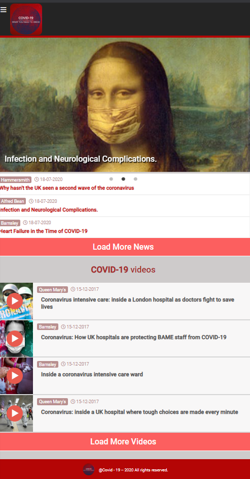

<h1 align="center"> Covid-19 </h1>
  
<h2 align="center"> 😷 what's up these days? 😷 </h2>

[The idea](#idea) | [Demo](#demo) | [Features](#features) | [Tech](#tech) | [Goals](#goals) | [Installation](#installation) | [About me](#about-me) 

## <a name="idea">The idea</a> 
A single-page web app for news and articles about Covid-19  
Designed for small screen width  

## <a name="demo"> To see the live demo:</a>[ visit here](https://covid-19-efe88.web.app/)🏃

## <a name="features">Features</a>
-  This app have 3 sections : articles , hospitals and videos.
-  User can see the news slider. 
-  User can see 3 articles and load more. 
-  User can see 3 videos and load more..
-  User can be registered by email.
- Registered user can access dashboard. 
- Registered user can post an article in news section with all the details and image.
- Registered user can logout and login .

## <a name="tech">Tech stack</a>

* built with: **JavaScript & React.js**

* continuous deployment: **Firebase**

##  <a name="goals">Goals & challenges</a>

- build a application for latest Covid-19 news and articles and videos.

- use and understand React design patterns, routes and many more.

- deploy the app to firebase.

## <a name="installation">Installation</a>

##### to install this project to your local machine
`git clonehttps://github.com/BarriF13/Covid-app-t` 
`cd Covid-app-t` 
`npm install`  

##### to run
run `npm start` and your default browser will pop up a window with the app!

## <a name="about-me">🎭About me</a>

  💎[My github CV](https://github.com/BarriF13/Barri_CV)  
  💎[My online portfolio](https://bdesignstudio.co.uk/)

Thanks you
